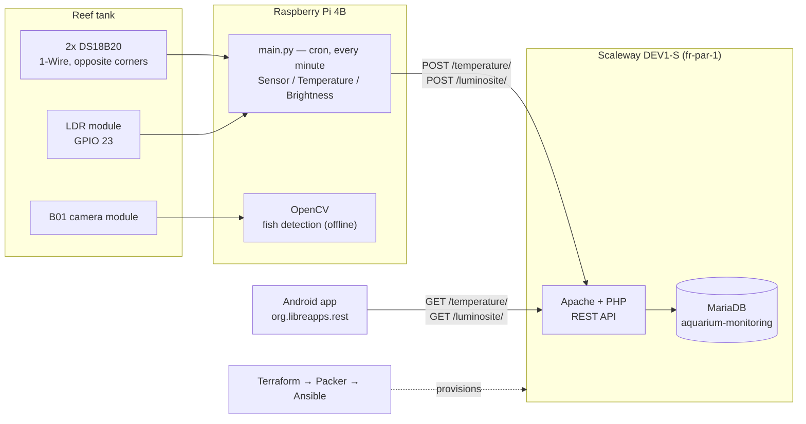

# Aquarium Monitoring System — HCFF

**Watching fish for signs of illness.** Most fish diseases show up first on the fish
itself — a mark on the skin, a change in colour, a fish that stops moving with the others —
and on the water it lives in. HCFF is an end-to-end IoT system that watches both: a camera
and sensors on the tank, a cloud database, and an Android app that puts a tank's readings
and each individual fish one tap away from its owner.

4th-year engineering project (IoT major, 2020), designed and tested on a real 500 L reef
tank holding 8 fish from 6 species.


*Home screen with live sensor cards and the fish carousel · the species sheet ·
the temperature history pulled from the cloud database.*

---

## Context

The brief was open, and we brought our own idea: Achille's father keeps a large reef tank,
and checking on it is a daily, manual, easy-to-get-wrong routine. Coral and fish are
sensitive to a degree of temperature or a lighting cycle drifting, and a sick fish is often
visible before it is in trouble — if someone is looking.

So the system was designed around **fish health** first, not around the sensors:

1. **See each fish.** A camera counts the fish and (in the target design) tells the species
   apart, so the app can show them one by one and the owner can track how each one *looks*
   over time — visual symptoms being the earliest warning of most health problems.
2. **Watch what they live in.** Water temperature and tank lighting, sampled every minute.
3. **Put it in the owner's hand.** An Android app with per-fish care sheets, so a reading
   can be judged against what the species actually needs — a Yellow Tang wants 23–28 °C,
   a Clark's Anemonefish 22–26 °C, and the app tells you which fish you're looking at.

The scope was cut deliberately along the way (see [Challenges](#challenges)) — species
recognition would have been an entire AI project on its own — but the direction is the point.


*The test reef tank. Bottom left: the Pi, the breadboard with both temperature probes and
the LDR module, and the camera module on its stand.*

## How it works



Payloads are flat JSON: `{"timestamp":"30/09/2020/12:34:50","temperature":25}`.

## Hardware


**Temperature** — two waterproof **DS18B20** probes on 1-Wire (pin 1 / 3.3 V, pin 7 /
GPIO 4, pin 9 / GND, 4.7 kΩ pull-up), placed in opposite corners of the tank. The code
averages them, but discards the second probe if the two disagree by more than 10 °C — a
plausibility check against a dead or unplugged sensor.

Left running overnight in the tank, the two probes stayed within **0.5 °C** of each other
and the water held around **26.5 °C** — exactly what a reef tank should do, which is how we
knew the readings were trustworthy.

**Brightness** — an **LDR module** (LM393 comparator, sensitivity trimmer) on pin 4 / 5 V,
pin 6 / GND, pin 16 / GPIO 23. Its output is a threshold comparison, so the tank light is
reported as on or off (100 / 0), not as a lux value.

**Camera** — a **B01 module** made for the Pi. We first tried the Withings and Samsung
cameras already pointed at the tank, but both are locked behind their own apps and were not
worth fighting; a dedicated module was cheaper and cooperative.

**Scheduling** — `cron` runs `main.py` every minute from boot, rather than an infinite loop
in Python: lighter, and it restarts on its own if a run dies.

```crontab
* * * * * sudo python /home/pi/Desktop/Final_Project/main.py
```

**Sensor classes** — `Sensor` is a base class with `getData()` / `sendData()`; `Temperature`
and `Brightness` implement it, and `main.py` just iterates a list. Adding a pH or water-level
probe means one new subclass and one line in that list.

## Image recognition

The goal was to recognise fish by species and flag visual signs of disease. Doing that
properly meant TensorFlow and a hand-labelled dataset of *these* fish — a whole project of
its own. We scaled it down to what OpenCV could do honestly.

| Frame differencing → contours | Contours filtered by minimum size → fish |
|---|---|
|  |  |

Consecutive frames are converted to greyscale, blurred and thresholded, then compared;
contours that moved between two frames are drawn. Filtering those contours by a minimum
size drops most of the false positives — drifting debris, waving anemones — and leaves the
fish. Counting the boxes per frame gives a fish count, averaged over the clip when the
program exits.

It detects and counts moving fish. It does **not** identify species or diagnose anything —
that was the next step, not a delivered one.

## The Android app

### From sketch to interface

The interface started on graph paper, went through Figma, and was then rebuilt properly in
Android Studio.

<table>
<tr>
<td width="30%"></td>
<td></td>
</tr>
<tr>
<td><em>The first sketch: fish box on top, sensor box below.</em></td>
<td><em>The Figma prototype — home, per-sensor graphs, profile, settings, notification thresholds.</em></td>
</tr>
</table>

Figma exports Android code per element, which looked like a shortcut and was mostly a trap:
the pieces did not fit together, some did not work, and stacking its generated layouts made
text disappear. We deleted the unused XML and rebuilt the screens cleanly — which fixed the
layout bugs — keeping Figma as the design reference rather than the code source. Circular
fish photos aren't a built-in on Android either, hence the `CircleImageView` dependency.

### What shipped

**`MainPage`** — translucent dark header over an underwater backdrop, one card per sensor
(sky-blue badge, name, value pill), and the fish carousel. Cards are built from a
`DataCard` template and added from Java, so a new sensor is one more entry in a list.
Tapping a card opens its history; tapping the fish opens its species sheet. A refresh button
restarts the activity — there is no live push, so this is how you get new data.

**`Info_Fish_Activity`** — care sheet per species: order, genus, family, descriptor,
aquarium area, maintenance difficulty, food, water type, pH, temperature range, sociability.
This is what makes a reading actionable: 26 °C means nothing until you know which fish is in
the tank.

**`TemperatureTableActivity` / `LuminositeTableActivity`** — the raw `id / timestamp / value`
history from the API. Built first as a connection test between app and database, then kept
in the app because it was genuinely useful.

Networking is an `AsyncTask` over `HttpURLConnection` (`ConnectionRest`) with hand-rolled
JSON parsing — 2020 Android, before Retrofit was in our toolbox.

### About these screenshots

The original device screenshots didn't survive. [`docs/mockup.html`](docs/mockup.html)
reconstructs the three screens from the actual layout XML, colours and image assets in
`app/src/main/res/`, and `docs/shot.sh` renders it:

```sh
docs/shot.sh    # docs/mockup.html -> docs/app-screens.png (needs Chrome)
```

## Cloud and infrastructure

The database and REST API ran on a Scaleway DEV1-S instance (Ubuntu, `fr-par-1`) rather than
on the Pi, so a Pi crash or an SD card failure could not take the history with it.

The instance is reproducible from code: **Terraform** creates the server and its public IP,
**Packer** builds an image from it, and the **Ansible** playbook installs Apache, MariaDB and
PHP and restores `aquarium-monitoring.sql`. Packer snapshots the configured result, so the
whole backend can be rebuilt from scratch after a crash.

## Repository layout

| Path | What's in it |
|---|---|
| `RPi code/` | Sensor polling on the Pi: `Sensor` base class, `Temperature`, `Brightness`, `tools.py`, `main.py`. |
| `Cloud/` | `scaleway.tf`, `packer.json`, `aquariumScalewayInstance.yml` (Ansible), `aquarium-monitoring.sql` (schema + captured readings). |
| `ANDROID APP/Android_REST/` | The Android app — Java, minSdk 16 / compileSdk 29, AndroidX + Material, `circleimageview`, `tableview`. |
| `Archive/Image Recognition/` | OpenCV fish detection (contours and boxes variants) with the test footage. |
| `Archive/Sensors/` | The first single-file sensor scripts, before the class refactor. |
| `Reports/` | Final report, partial report, and the two defence presentations. |
| `docs/` | Screenshots, report figures, and the HTML rebuild of the app screens. |

## Status — this is an archive, not a deployment

The system ran, on a real tank, in 2020. It cannot be launched as-is today:

- The Scaleway instance and its database no longer exist, and its host is hardcoded in
  `DataTemperature` / `DataLuminosite`. The app builds and runs; it has nothing to talk to.
- No auth on the API, and `usesCleartextTraffic` is enabled — fine for a lab, not for the
  internet.
- Brightness is binary (0 / 100), not a lux reading.
- Image recognition never made it into the live pipeline; it runs offline on recorded clips.
- Build outputs, `terraform.exe` and the Terraform provider binary were committed at the time.

The Python and Android code, the Terraform/Packer/Ansible definitions and the SQL dump are
all here, so the pieces are readable and reusable even though the whole no longer stands up.

## What was planned next

Graphs instead of raw tables (as in the Figma prototype), pH and water-level sensors, an
automatic feeder for when the owner is away, notification thresholds and user accounts —
and then the multi-tank version: many HCFF units on one database, so a public aquarium could
watch every basin at once.

The fifth-year follow-up took that further on paper: one **SmartMesh IP** mote per tank, a
much wider sensor set (pH, salinity, NO₂, NH₃, dissolved oxygen, alkalinity, TDS, EC, leak),
actuators (heater, LED, air and water pumps, RO filter, feeder), Node-RED for control logic
and alerting, and a Django + React web app for multi-tank operators.

## Challenges

**Scope.** The first instinct was every sensor at once. We cut to two and spent the effort on
an architecture where the third is cheap to add — which is why the sensor classes and the
data cards are both list-driven.

**The AI we didn't build.** Species recognition and diagnosis from scale colour needed a
custom labelled dataset and a real ML pipeline. We said no and shipped movement detection
instead.

**Plumbing.** The REST client on the Pi side threw errors for a long while, and working out
how the tools fit together took as much time as writing them.

**Lockdown.** The semester was remote from the start, so we never worked in the same room.
Achille had the hardware and the tank; Julien and Nicolas worked on the software. The split
was forced on us, and Git is what made it work.

## Credits

Julien Rosé · Achille Bayart · Nicolas Rigaudy

Full report and defence slides in [`Reports/`](Reports/).
Original project repository: <https://github.com/Nicolas-Rigaudy/Aquarium-Monitoring-System>
