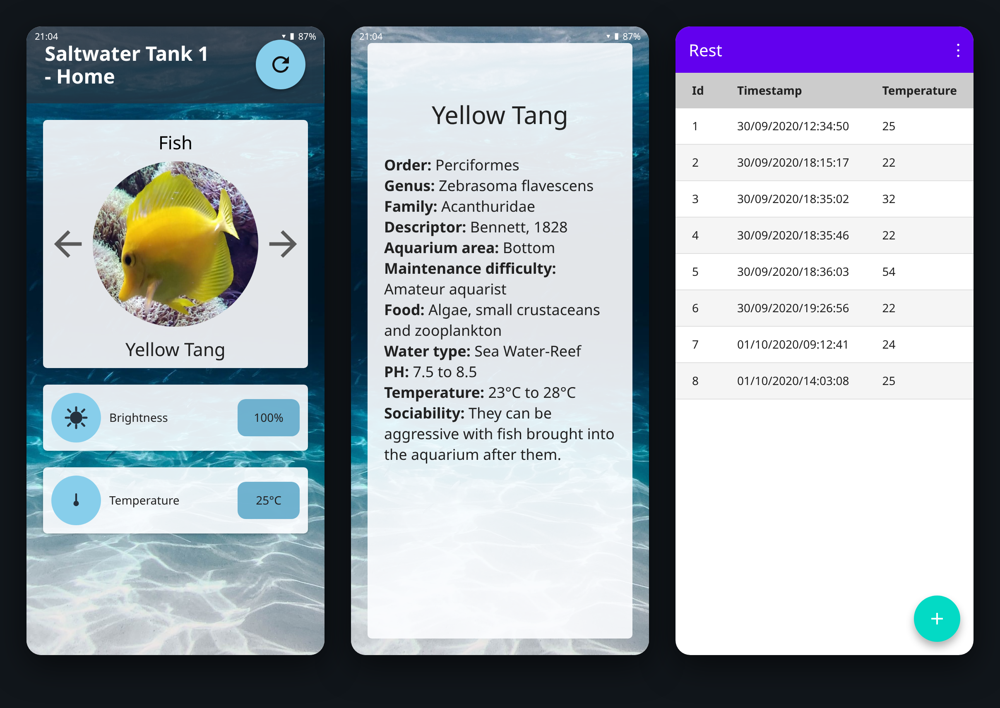
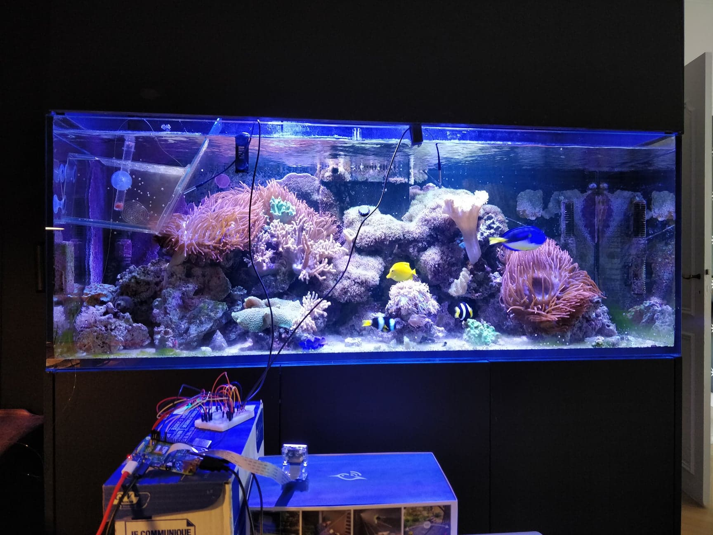
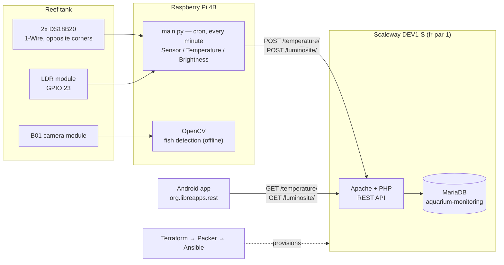
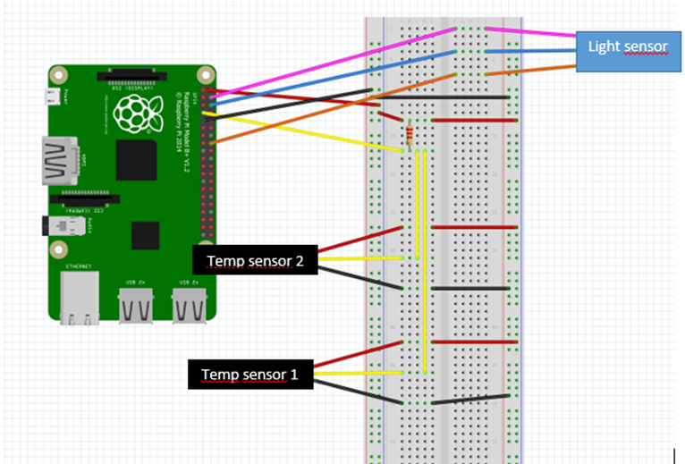
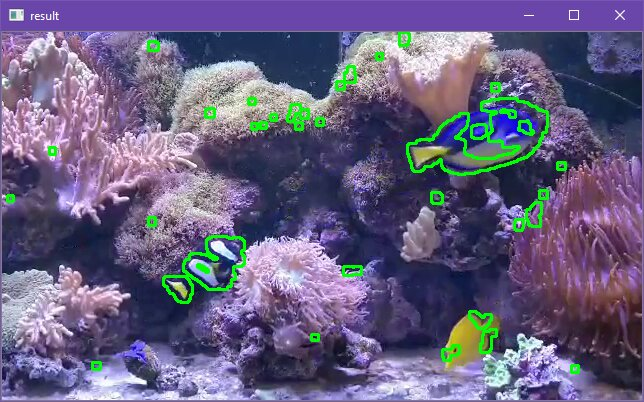
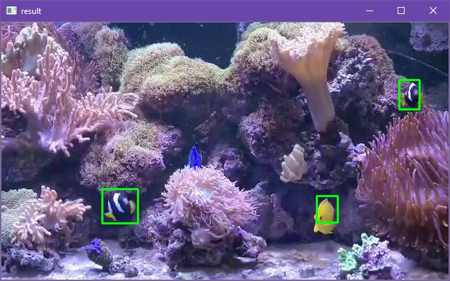
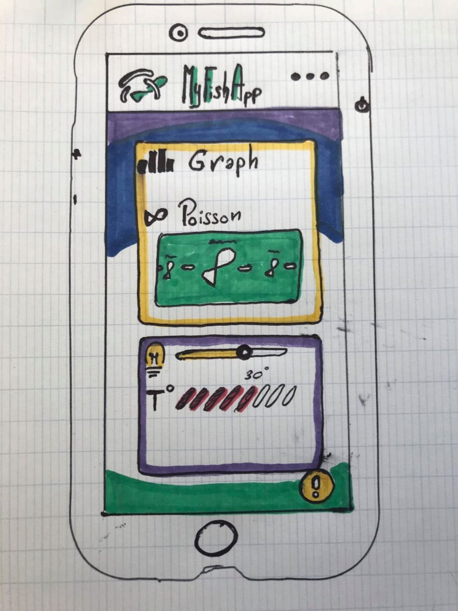
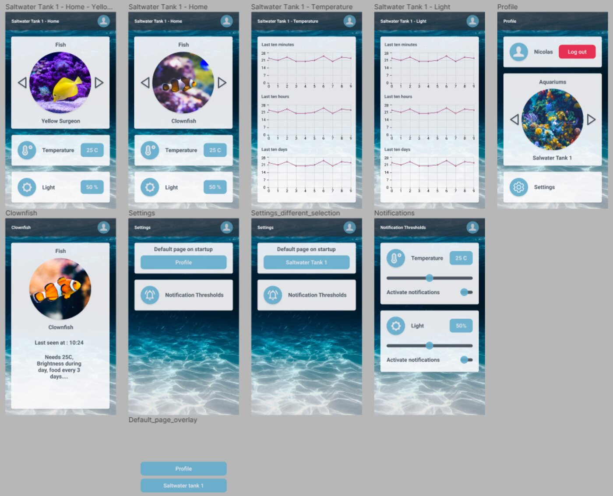

# Aquarium Monitoring System — HCFF

**The goal was to spot sick fish before their owner does.** Ich, fin rot, velvet, fungal
infection — nearly every common aquarium disease announces itself visually first: white
spots on the skin, frayed fins, a colour that dulls, a fish that stops swimming with the
others. And nearly all of them are triggered by the water going wrong before that: a heater
drifting two degrees, a lighting cycle breaking, stress that opens the door to a parasite
already in the tank.

HCFF watches both halves of that story. A camera on the tank looking at the fish, sensors
in the water looking at what stresses them, a cloud database keeping the history, and an
Android app that puts every reading and every individual fish one tap away from the owner.

4th-year engineering project (IoT major, 2020), designed and tested on a real reef tank
holding 8 fish from 6 species.



*Home screen with live sensor cards and the fish carousel · the species sheet ·
the temperature history pulled from the cloud database.*

---

## Context

The brief was open and we brought our own idea. Achille's father keeps a large reef tank,
and checking on it is a daily, manual, easy-to-get-wrong routine: count the fish, look each
one over, read the thermometer, notice the light came on. A disease caught on day one is
treatable; caught on day five it has usually spread. But it only gets caught if someone is
looking, and nobody looks at 3 a.m. or while away for a week.

So every part of the system exists to answer one question — *is a fish getting sick?* —
from a different angle:

| Angle | What it does | Why it matters for disease |
|---|---|---|
| **Look at the fish** | Camera + OpenCV: detect and count the fish on screen | A fish that stops appearing has hidden, is being bullied, or is too weak to swim — often the first symptom |
| **Look at the water** | Two temperature probes and a light sensor, sampled every minute | Temperature swings and broken light cycles are the stressors that let parasites take hold |
| **Keep the history** | Every reading timestamped into a cloud database | A single 26 °C reading says nothing; a slow drift over three days is the actual warning |
| **Show it per fish** | Android app: carousel of the individual fish + a care sheet per species | 24 °C is fine for a Clark's Anemonefish and cold for a Clown Anemonefish — a reading only means something against the species in the tank |

That last one is the point of the fish carousel. The app doesn't just show a number, it
shows *this fish*, its species, and the range that species needs, so the owner can judge a
reading instead of just reading it.



*The test reef tank. Bottom left: the Pi, the breadboard with both temperature probes and
the LDR module, and the camera module on its stand.*

## How it works



Payloads are flat JSON: `{"timestamp":"30/09/2020/12:34:50","temperature":25}`.

## Hardware



**Temperature** — two waterproof **DS18B20** probes on 1-Wire (pin 1 / 3.3 V, pin 7 /
GPIO 4, pin 9 / GND, 4.7 kΩ pull-up), placed in opposite corners of the tank. The code
averages them, but discards the second probe if the two disagree by more than 10 °C — a
plausibility check against a dead or unplugged sensor.

Left running overnight in the tank, the two probes stayed within **0.5 °C** of each other
and the water held around **26.5 °C** — exactly what a reef tank should do, which is how we
knew the readings were trustworthy.

**Brightness** — an **LDR module** (LM393 comparator, sensitivity trimmer) on pin 4 / 5 V,
pin 6 / GND, pin 16 / GPIO 23. Its output is a threshold comparison, so the tank light is
reported as on or off (100 / 0), not as a lux value.

**Camera** — a **B01 module** made for the Pi. We first tried the Withings and Samsung
cameras already pointed at the tank, but both are locked behind their own apps and were not
worth fighting; a dedicated module was cheaper and cooperative.

**Scheduling** — `cron` runs `main.py` every minute from boot, rather than an infinite loop
in Python: lighter, and it restarts on its own if a run dies.

```crontab
* * * * * sudo python /home/pi/Desktop/Final_Project/main.py
```

**Sensor classes** — `Sensor` is a base class with `getData()` / `sendData()`; `Temperature`
and `Brightness` implement it, and `main.py` just iterates a list. Adding a pH or water-level
probe means one new subclass and one line in that list.

## Identifying disease: the vision pipeline

This is the part that was meant to name a disease. The full pipeline we designed has four
stages, each one a prerequisite for the next:

1. **Find the fish in the frame** — separate animals from coral, rock and anemones.
2. **Count them** — a missing fish is itself a symptom, and the count is the cheapest signal
   the system can produce.
3. **Identify the species** — so each fish gets a stable identity across days and can be
   compared to how *it* looked yesterday, not to a generic fish.
4. **Read its appearance** — white spots, frayed fins, dulled colour, and cross-reference
   against the water history to say *why*.

Stages 1 and 2 are implemented and working. Stages 3 and 4 needed TensorFlow and a
hand-labelled dataset of these specific fish, photographed in these specific lighting
conditions, in enough quantity to train on — a complete AI project sitting inside a
semester-long IoT project. We chose to build the pipeline that feeds it rather than fake
the end of it.

### What runs today

| Frame differencing → contours | Contours filtered by minimum size → fish |
|---|---|
|  |  |

Consecutive frames are converted to greyscale, blurred and thresholded, then compared;
contours that moved between the two frames are drawn. Movement is the discriminator here —
coral and rock hold still, fish do not — which is what makes stage 1 work without any
training data at all.

The left image is the raw result: fish outlined, but so is every swaying anemone tip and
piece of drifting debris. Filtering contours by a minimum area removes them, and the right
image is what's left — three fish, three boxes. Counting boxes per frame gives a live fish
count, averaged over the clip when the program exits (2.5 on the test footage, for a scene
where fish swim in and out of view).

It detects and counts moving fish. It does **not** identify species or diagnose anything —
those are stages 3 and 4, and they were never built.

## The Android app

### From sketch to interface

The interface started on graph paper, went through Figma, and was then rebuilt properly in
Android Studio.

<table>
<tr>
<td width="30%"></td>
<td></td>
</tr>
<tr>
<td><em>The first sketch: fish box on top, sensor box below.</em></td>
<td><em>The Figma prototype — home, per-sensor graphs, profile, settings, notification thresholds.</em></td>
</tr>
</table>

Figma exports Android code per element, which looked like a shortcut and was mostly a trap:
the pieces did not fit together, some did not work, and stacking its generated layouts made
text disappear. We deleted the unused XML and rebuilt the screens cleanly — which fixed the
layout bugs — keeping Figma as the design reference rather than the code source. Circular
fish photos aren't a built-in on Android either, hence the `CircleImageView` dependency.

### What shipped

**`MainPage`** — translucent dark header over an underwater backdrop, one card per sensor
(sky-blue badge, name, value pill), and the fish carousel. Cards are built from a
`DataCard` template and added from Java, so a new sensor is one more entry in a list.
Tapping a card opens its history; tapping the fish opens its species sheet. A refresh button
restarts the activity — there is no live push, so this is how you get new data.

**`Info_Fish_Activity`** — care sheet per species: order, genus, family, descriptor,
aquarium area, maintenance difficulty, food, water type, pH, temperature range, sociability.
This is what makes a reading actionable: 26 °C means nothing until you know which fish is in
the tank.

**`TemperatureTableActivity` / `LuminositeTableActivity`** — the raw `id / timestamp / value`
history from the API. Built first as a connection test between app and database, then kept
in the app because it was genuinely useful.

Networking is an `AsyncTask` over `HttpURLConnection` (`ConnectionRest`) with hand-rolled
JSON parsing — 2020 Android, before Retrofit was in our toolbox.

### About these screenshots

The original device screenshots didn't survive. [`docs/mockup.html`](docs/mockup.html)
reconstructs the three screens from the actual layout XML, colours and image assets in
`app/src/main/res/`, and `docs/shot.sh` renders it:

```sh
docs/shot.sh    # docs/mockup.html -> docs/app-screens.png (needs Chrome)
```

## Cloud

The database and REST API ran on a Scaleway DEV1-S instance (Ubuntu, `fr-par-1`) rather than
on the Pi, so a Pi crash or a dead SD card could not take the history with it — and the app
could reach the data from anywhere without punching a hole into a home network.

The whole instance is rebuildable from code; see
[After the report](#after-the-report-making-the-backend-disposable).

## Repository layout

| Path | What's in it |
|---|---|
| `RPi code/` | Sensor polling on the Pi: `Sensor` base class, `Temperature`, `Brightness`, `tools.py`, `main.py`. |
| `Cloud/` | `scaleway.tf`, `packer.json`, `aquariumScalewayInstance.yml` (Ansible), `aquarium-monitoring.sql` (schema + captured readings). |
| `ANDROID APP/Android_REST/` | The Android app — Java, minSdk 16 / compileSdk 29, AndroidX + Material, `circleimageview`, `tableview`. |
| `Archive/Image Recognition/` | OpenCV fish detection (contours and boxes variants) with the test footage. |
| `Archive/Sensors/` | The first single-file sensor scripts, before the class refactor. |
| `Reports/` | Final report, partial report, and the two defence presentations. |
| `docs/` | Screenshots, report figures, and the HTML rebuild of the app screens. |

## Status — this is an archive, not a deployment

The system ran, on a real tank, in 2020. It cannot be launched as-is today:

- The Scaleway instance and its database no longer exist, and its host is hardcoded in
  `DataTemperature` / `DataLuminosite`. The app builds and runs; it has nothing to talk to.
- No auth on the API, and `usesCleartextTraffic` is enabled — fine for a lab, not for the
  internet.
- Brightness is binary (0 / 100), not a lux reading.
- Image recognition never made it into the live pipeline; it runs offline on recorded clips.
- Build outputs, `terraform.exe` and the Terraform provider binary were committed at the time.

The Python and Android code, the Terraform/Packer/Ansible definitions and the SQL dump are
all here, so the pieces are readable and reusable even though the whole no longer stands up.

## After the report: making the backend disposable

The written report stops in early October 2020. The last three weeks of commits are about
something it doesn't cover, and it's the piece that mattered most for a system meant to run
unattended for months: **the cloud side stopped being a pet server**.

The problem was concrete. The disease signal is the *history* — a temperature drift over
days, a fish count dropping — and all of it lived on one Scaleway instance that a bad
upgrade or a stopped billing cycle could erase. So we rebuilt the backend as code:

1. **Terraform** (`Cloud/scaleway.tf`) declares the instance and its public IP: a DEV1-S on
   `ubuntu-focal` in `fr-par-1`. `terraform apply` gives a fresh, empty server on demand.
2. **Ansible** (`Cloud/aquariumScalewayInstance.yml`) provisions it: Apache, MariaDB, PHP and
   the modules the REST API needs, then creates the `aquarium-monitoring` database and
   imports `aquarium-monitoring.sql` — schema *and* the readings already captured. DB
   credentials are prompted at run time rather than committed (`vars/main.yml` ships empty).
3. **Packer** (`Cloud/packer.json`) drives the whole thing headlessly: it boots a build
   server, runs `apt update && upgrade`, hands off to the Ansible playbook, and snapshots the
   configured machine as a reusable image.

The result is that losing the instance costs one command instead of a weekend, and the
data survives it. Two design decisions in there are worth naming: the SQL dump is restored
by the playbook rather than the schema being recreated task by task (one source of truth,
and the history comes back with it), and Packer calls Ansible rather than duplicating it, so
there is exactly one description of what the server contains.

### Still open

These were on the report's wish list and are **not** in this repository — nobody built them
before the project closed:

- Graphs instead of raw history tables (they exist as Figma screens, not as code).
- pH and water-level sensors — cheap to add thanks to the `Sensor` base class, but not added.
- Automatic feeder, notification thresholds, user accounts.
- Species recognition and disease classification — stages 3 and 4 of the vision pipeline.
- The multi-tank version for professional aquariums.

The fifth-year follow-up designed that last one on paper: one **SmartMesh IP** mote per tank,
a much wider sensor set (pH, salinity, NO₂, NH₃, dissolved oxygen, alkalinity, TDS, EC,
leak), actuators (heater, LED, air and water pumps, RO filter, feeder), Node-RED for control
logic and alerting, and a Django + React web app for multi-tank operators. It stayed a
proposal.

## Challenges

**Scope.** The first instinct was every sensor at once. We cut to two and spent the effort on
an architecture where the third is cheap to add — which is why the sensor classes and the
data cards are both list-driven.

**The AI we didn't build.** Species recognition and diagnosis from scale colour needed a
custom labelled dataset and a real ML pipeline. We said no and shipped movement detection
instead.

**Plumbing.** The REST client on the Pi side threw errors for a long while, and working out
how the tools fit together took as much time as writing them.

**Lockdown.** The semester was remote from the start, so we never worked in the same room.
Achille had the hardware and the tank; Julien and Nicolas worked on the software. The split
was forced on us, and Git is what made it work.

## Credits

Julien Rosé · Achille Bayart · Nicolas Rigaudy

Full report and defence slides in [`Reports/`](Reports/).
Original project repository: <https://github.com/Nicolas-Rigaudy/Aquarium-Monitoring-System>
